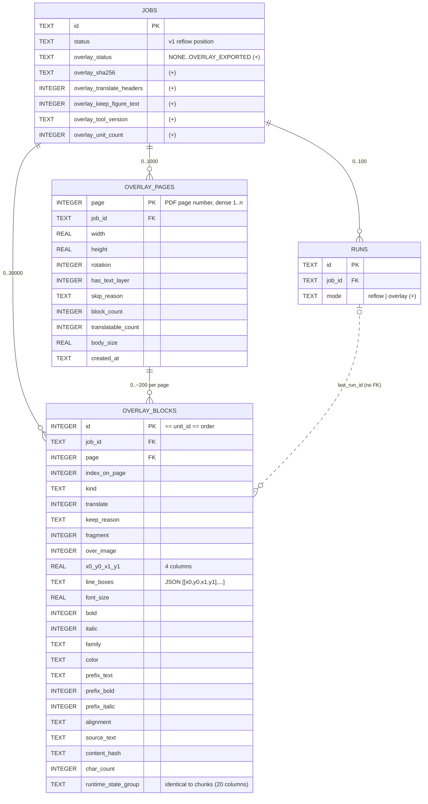

# DB Design v1.1: schema v2 for the overlay pass (`book-translator`)

**Baseline:** `docs/03_db_design.md` (schema v1, implemented in `src/database/models.py`, `session.py`, `repository.py`, tested by `tests/test_repository.py`).
**Input:** `docs/06_solution_design_v1_1.md` §1 (D5/D6/D7/D18), §3.6, §5.7, **§6** (persistence brief), §9.3; `docs/05_change_request_v1_1_ba.md` US-19/20/21, FR-41/45/49, NFR-28/32, E-42…E-52.
**Date:** 2026-09-18
**Status:** DB Architect output → DB Developer (v1.1)

Every convention of doc 03 stays in force unless a row below says otherwise: `snake_case`, plural table names, TEXT timestamps of exactly 27 chars produced by Python only, booleans as `INTEGER` 0/1 with CHECK (storage class; the SQLAlchemy `Boolean(create_constraint=True)` columns are **declared** `BOOLEAN` in the DDL, so `PRAGMA table_info` reports `BOOLEAN` for them and `INTEGER` only for the two nullable `prefix_*` flags — the ER diagram below shows the storage class), enums as `TEXT` + CHECK, JSON as `TEXT` validated by a `TypeDecorator`, conditional transitions as Core `UPDATE … WHERE <precondition>` + `rowcount`, `BEGIN IMMEDIATE` for every write, `IN` lists batched at 500, no `RETURNING`, no `UPSERT`, SQLite floor 3.8.0 / tested floor 3.31.

---

## Türkçe Özet

Bu doküman v1.1'in **overlay** (sayfa düzenini koruyan çeviri) geçişi için veri modelini tanımlar; F1 ve F3 şema değişikliği gerektirmez. Kararların özü:

- **İki yeni tablo:** `overlay_pages` (sayfa başına 1 satır, ≤ 1 000) ve `overlay_blocks` (metin bloğu başına 1 satır, ≤ 30 000). `overlay_blocks`, `chunks` ile **birebir aynı çalışma-zamanı durum kolon grubunu** taşır (aynı isimler, aynı CHECK'ler: `translated_text ⇔ COMPLETED`, `next_attempt_at` yalnız PENDING'de, sayaçlar ≥ 0). Geometri/stil kolonları yazılıp bir daha değişmez.
- **`jobs`** 6 yeni kolon alır (overlay iş akışı konumu `overlay_status` + kendi enum'u, `overlay_sha256`, iki seçenek bayrağı, araç sürümü, birim sayısı); **`runs`** `mode` kolonu alır (`reflow` | `overlay`, mevcut satırlar için `reflow`).
- **Toplu claim** (`claim_pending_batch`): v1 claim'in aynısı, tek fark SELECT'in `LIMIT max_units` ile `page` ve `char_count` da döndürmesi ve Python'da "≥ min_chars **ve** sayfa sınırı" kuralıyla kesilmesi. `BEGIN IMMEDIATE` + `status='PENDING'` yeniden kontrolü + `rowcount` tripwire'ı aynen korunur.
- **Index:** `chunks`'ın üç index'inin kopyası + sayfa erişimi için tek bir `(job_id, page, status)` index'i. EXPLAIN ile doğrulandı (§0): claim `ix_overlay_blocks_job_status` kullanır, sıralama adımı yok; sayfa ilerlemesi tamamen index üzerinden hesaplanır.
- **O5 kararı:** yerleştirme sonucu (`last_scale`, `last_reason`) **DB'ye yazılmaz**; `overlay_review.json` tek kaynak kalır (gerekçe §5).
- **Geçiş 1→2:** yalnızca ekleme (2 tablo, 4 index, 7 `ADD COLUMN`), tek `BEGIN IMMEDIATE` işlemi, önce yedek, en son sürüm numarası. Veri yeniden yazılmaz; mevcut `chunks`/`runs`/`lease` satırlarına dokunulmaz. Salt-okunur açılış (`status`) v1 **ve** v2 dosyayı kabul eder (D18).
- **Dikkat (gözlem):** `docs/test_doc_output/translation_state.db` şu an **0 bayt**; geçiş testi için v1 fixture'ı DB Developer'ın, `models.py`'yi değiştirmeden **önce** dondurduğu bir v1 DDL dökümünden üretilecek (§8.6, DQ1).

---

## 0. Evidence gathered for this design (verified in this session, SQLite 3.45.1 in `.venv`)

| # | Observation | Consequence |
|---|---|---|
| V0 | `docs/test_doc_output/translation_state.db` is a **0-byte file**; `sqlite_master` is empty. `open_database()` treats a 0-byte file as "create" (session.py `needs_create`), so opening it with v1.1 would create a fresh v2 schema, **not** run a migration. | The migration fixture named in the brief does not exist as a v1 database today. §8.6 / DQ1: the DB Developer freezes the v1 DDL into `tests/fixtures/v1_schema.sql` before touching `models.py` and the migration test builds its v1 file from that. The repo also has no git history yet (`git log` → no commits), so the DDL cannot be recovered from a tag later. |
| V1 | On a 9 000-row `overlay_blocks` with the four indexes of §7: the batch-claim SELECT (`… status='PENDING' AND (next_attempt_at IS NULL OR next_attempt_at <= ?) ORDER BY id LIMIT 50`) → `SEARCH … USING INDEX ix_overlay_blocks_job_status (job_id=? AND status=?)`, no TEMP B-TREE, no scan. Adding a keyset `AND id > ?` keeps the same index (`rowid>?` appended). | Same plan as v1 CR-17: the composite `(job_id, status)` index with rowid-ordered entries is the claim index; the partial backoff index is not. Acceptance check O-4 asserts it. |
| V2 | `SELECT page, COUNT(*) … WHERE job_id=? AND status='COMPLETED' GROUP BY page` and the correlated per-page count of §6.4 → `COVERING INDEX ix_overlay_blocks_job_page_status`, no sort, no table access. `WHERE job_id=? AND page=? ORDER BY id` → the same index + a TEMP B-TREE over the ≤ ~200 entries of one page. | `page_progress` never touches the 15–60 MB table; the per-page sort in `iter_page` is microseconds and accepted (§7). |
| V3 | `MIN(next_attempt_at)` and the "waiting for backoff" count → `COVERING INDEX ix_overlay_blocks_pending_backoff`; counts per status → covering `ix_overlay_blocks_job_status`; review ids → covering partial `ix_overlay_blocks_review`. | The three v1 indexes transfer unchanged. |
| V4 | `ALTER TABLE … ADD COLUMN col TYPE NOT NULL DEFAULT x CONSTRAINT ck_name CHECK (…)` works inside `BEGIN IMMEDIATE`, accepts **named** column constraints and a CHECK that references another column (`(overlay_status = 'NONE') = (overlay_sha256 IS NULL)`); existing rows read the default; violations afterwards fail with the constraint **name**. `PRAGMA table_info` reports the new columns, which gives the idempotency guard for re-runs. | The migration is pure `ADD COLUMN`; no table rebuild, no 12-step procedure. Constraint names survive, so the repository boundary keeps naming the constraint in `Err(INTERNAL)`. |
| V5 | v1 `_worker` completes a non-translatable chunk **after** claiming it (verbatim `TranslationResult`, `chars_sent=0`, `attempts=0`). | Overlay units with `translate = 0` are claimed like any unit and completed with `translated_text = source_text`; they contribute 0 chars to the batch's `min_chars` rule (§6.3). |
| V6 | `BBox` is `Tuple[float, float, float, float]` in `extractors/cleanup.py` (a plain alias, no class). | The database layer stores four REAL columns and returns plain 4-tuples; no `database → extractors` import is needed (layering §2.5 of doc 06). |

---

## 1. Decision summary (binding for the DB Developer)

| # | Topic | Decision |
|---|---|---|
| B1 | Table names (final) | `overlay_pages`, `overlay_blocks`. Plural, like `chunks`/`runs`. |
| B2 | Unit identity | `overlay_blocks.id INTEGER PRIMARY KEY` = rowid alias = `unit_id` = `order`, dense `1..n` per job in `(page, y0, x0)` order (doc 06 §4.4 step 10). Exactly the `chunks.id` rule; explicit values, no AUTOINCREMENT. |
| B3 | `block_id` string | **Not stored.** `"p{page:03d}-b{index_on_page:03d}"` is a function of two stored columns; storing it would be a stored functional dependency (redundancy with an update anomaly), the same argument doc 03 §3 used for `order`. The repository derives it in `_to_block()`. Deviation from the §6 wording "stable block_id string" — the string is still stable, it is just computed. |
| B4 | Page identity | `overlay_pages.page INTEGER PRIMARY KEY` (rowid alias, the PDF page number, dense `1..n`) + `job_id` FK. Valid because the DB is single-job (`jobs.singleton`); mirrors `chunks.id`. |
| B5 | Pages table vs derivation | Separate table. Pages without a text layer have **no** units but must be reported (`pages_skipped`, exit 2) and the export needs `width/height/rotation/skip_reason` per page without re-deriving anything. `block_count`/`translatable_count` are stored once at `replace_all` (denormalization justified in §4). |
| B6 | Geometry | `bbox` as four `REAL` columns (`x0, y0, x1, y1`) with a CHECK; `line_boxes` as a JSON array of 4-number arrays (never queried, write-once) through a new `JsonBoxes` type decorator. |
| B7 | Style | Typed columns (`font_size REAL`, `bold`, `italic`, `family` enum, `color` `#rrggbb`), and the optional prefix style as three nullable columns bound by one group CHECK (`ck_overlay_blocks_prefix_style`), the `ck_chunks_subsplit` pattern. No JSON blob for style: every field is scalar and CHECK-able. |
| B8 | Runtime state | Column group copied from `chunks` **verbatim** (names, types, defaults, CHECKs). One shared helper in `models.py` (`_runtime_state_columns()` / a mixin) so the two tables cannot drift; a test asserts equality of the two column groups (O-1). |
| B9 | Repository shape | One class `OverlayBlockRepository` implementing `UnitRepository[OverlayBlock]` (same method names/signatures as `ChunkRepository`) **plus** the page helpers. No separate `OverlayPageRepository`: pages and blocks are written in one transaction by `replace_all` and read together; a second class would only split one transaction across two objects. |
| B10 | `replace_all` signature | `replace_all(job_id, units, pages=())` — the extra keyword-only optional parameter keeps structural compatibility with the Protocol (`replace_all(job_id, units)`) while letting the overlay stage insert pages and blocks atomically. The orchestrator's overlay stage always passes `pages=extraction.pages`. |
| B11 | Batch claim | `claim_pending_batch(job_id, max_units, min_chars, now, run_id)` = v1 `claim_pending` with a wider step-1 SELECT (`id, page, char_count, translate`, `LIMIT max_units`) and the stop rule applied in Python before step 2. Same `BEGIN IMMEDIATE`, same `status = 'PENDING'` re-check, same `rowcount == len(ids)` tripwire (§6.3). `claim_pending(limit)` is kept as the Protocol method and is implemented as `claim_pending_batch(max_units=limit, min_chars=0)` with the page rule disabled (§6.3, "plain mode"). |
| B12 | Placement outcome (O5) | **Not persisted** per block; `overlay_review.json` stays the only record (§5). |
| B13 | `jobs` additions | `overlay_status` (own enum + CHECK, default `'NONE'`), `overlay_sha256`, `overlay_translate_headers`, `overlay_keep_figure_text`, `overlay_tool_version`, `overlay_unit_count`. One binding CHECK: `(overlay_status = 'NONE') = (overlay_sha256 IS NULL)`. |
| B14 | `runs` addition | `mode TEXT NOT NULL DEFAULT 'reflow' CHECK (mode IN ('reflow','overlay'))`. Existing rows read `'reflow'` through the default. `count_completed_by_run` is routed to `chunks` or `overlay_blocks` by this column. |
| B15 | Schema version | `CURRENT_SCHEMA_VERSION = 2`; `READ_ONLY_ACCEPTED_VERSIONS = (1, 2)` (D18). Write opens migrate 1→2; read-only opens accept both and expose `Database.schema_version` so the orchestrator reports "no overlay pass" on a v1 file without touching absent tables. |
| B16 | Migration | Additive only, one `BEGIN IMMEDIATE` transaction, backup first, version bump last, idempotent via `IF NOT EXISTS` and a `PRAGMA table_info` guard before each `ADD COLUMN` (§8). |
| B17 | FK from blocks to pages | `overlay_blocks.page → overlay_pages.page ON DELETE CASCADE` (parent key is the PK). Enforces "every unit sits on a known page" at the DB level; `replace_all` deletes blocks before pages anyway, so the cascade never does real work. |
| B18 | Composite index width | One index has **three** columns (`job_id, page, status`) — a documented exception to doc 03's "never more than 2" so `page_progress` is index-only (V2). Still far under the "> 4" prohibition. |

---

## 2. Schema overview (v2 delta)



`chunks`, `lease`, `schema_meta` are unchanged. `chunks` and `overlay_blocks` never reference each other (D6: two independent passes sharing one job, one lease, one provider/glossary binding).

Rejected alternatives (for the record): reusing `chunks` with a `unit_type` column (D6 reasons a–d); a `placements` table for export outcomes (§5); an `overlay_exports` history table (export is stateless; `runs` already records the command).

---

## 3. Table design

Conventions as in doc 03 §2: **Storage / SA type**; every timestamp column carries `CHECK (col IS NULL OR length(col) = 27)` (`_ts_check`); no SQL timestamp defaults; enum CHECKs via `_enum_check`; non-negative counters via `_nonneg_check`; booleans `Boolean(create_constraint=True, name="ck_<table>_<col>")`.

### 3.1 `overlay_pages` (new)

Purpose: one row per PDF page of the overlay pass; page geometry and the copy-unchanged decision for the exporter, page counts for `status`/summary.

| Column | Storage / SA type | Null | Default | Description |
|---|---|---|---|---|
| page | INTEGER / `Integer` | NO | | `INTEGER PRIMARY KEY` (rowid alias), 1-based PDF page number; `CHECK (page >= 1)`; explicit values, no AUTOINCREMENT |
| job_id | TEXT / `String(36)` | NO | | FK → `jobs.id` ON DELETE CASCADE |
| width | REAL / `Float` | NO | | Page width in pt (after rotation as PyMuPDF reports `page.rect`); `CHECK (width > 0)` |
| height | REAL / `Float` | NO | | `CHECK (height > 0)` |
| rotation | INTEGER / `Integer` | NO | 0 | `CHECK (rotation IN (0, 90, 180, 270))` |
| has_text_layer | INTEGER / `Boolean(create_constraint=True)` | NO | | `CHECK IN (0,1)` |
| skip_reason | TEXT / `String(20)` | YES | | `CHECK (skip_reason IS NULL OR skip_reason IN ('no_text_layer'))` (the only v1.1 value; the list is a constant `OVERLAY_PAGE_SKIP_REASONS`) |
| block_count | INTEGER / `Integer` | NO | 0 | Units on this page (all kinds); `CHECK (block_count >= 0)` |
| translatable_count | INTEGER / `Integer` | NO | 0 | Units with `translate = 1`; `CHECK (translatable_count >= 0 AND translatable_count <= block_count)` |
| body_size | REAL / `Float` | NO | 0 | Dominant body font size (pt) used by the kind heuristics; `CHECK (body_size >= 0)` (0 on a page without text) |
| created_at | TEXT / `UtcTimestamp` | NO | | Set by `replace_all` |

Group CHECKs:

```sql
CONSTRAINT ck_overlay_pages_skip CHECK (has_text_layer = 1 OR skip_reason IS NOT NULL)   -- a page without a text layer always says why
CONSTRAINT ck_overlay_pages_skip_empty CHECK (skip_reason IS NULL OR block_count = 0)     -- a skipped page carries no units
```

Constraints summary: `PK (page)`, `FK (job_id) → jobs(id) ON DELETE CASCADE`, CHECKs above. No `updated_at`: rows are write-once (only `replace_all` writes them). No index beyond the PK (≤ 1 000 rows; `WHERE job_id = ? ORDER BY page` is a 1 000-row scan, V2).

### 3.2 `overlay_blocks` (new)

Purpose: one row per overlay translation unit (text block): write-once extraction facts + the mutable runtime state group of `chunks`.

**Static (write-once) columns**

| Column | Storage / SA type | Null | Default | Description |
|---|---|---|---|---|
| id | INTEGER / `Integer` | NO | | `INTEGER PRIMARY KEY` = `unit_id` = `order`; `CHECK (id >= 1)`; explicit values, dense `1..n` (validated in Python by `replace_all`) |
| job_id | TEXT / `String(36)` | NO | | FK → `jobs.id` ON DELETE CASCADE |
| page | INTEGER / `Integer` | NO | | FK → `overlay_pages.page` ON DELETE CASCADE; `CHECK (page >= 1)` |
| index_on_page | INTEGER / `Integer` | NO | | 1-based reading-order index on the page; `CHECK (index_on_page >= 1)`. Dense per page, validated in Python (no UNIQUE index — see §7) |
| kind | TEXT / `String(12)` | NO | | `CHECK IN ('body','heading','caption','header','footer','page_number','figure_label','table_cell','footnote')` = `OverlayBlockKind.value` (constant `OVERLAY_BLOCK_KINDS`) |
| translate | INTEGER / `Boolean(create_constraint=True)` | NO | | `CHECK IN (0,1)`; `CHECK (kind <> 'page_number' OR translate = 0)` (`ck_overlay_blocks_page_number_kept`, FR-46 "never") |
| keep_reason | TEXT / `String(16)` | YES | | `CHECK (keep_reason IS NULL OR keep_reason IN ('page_number','header_footer','figure_text','rotated','no_letters','no_bbox','widget_overlap'))`; `CHECK ((translate = 1) = (keep_reason IS NULL))` (`ck_overlay_blocks_keep_reason`) — a kept unit always says why, a translated unit never carries a stale reason |
| fragment | INTEGER / `Boolean(create_constraint=True)` | NO | 0 | E-42 |
| over_image | INTEGER / `Boolean(create_constraint=True)` | NO | 0 | E-40 (informational) |
| x0 | REAL / `Float` | NO | | Unit rect (union of line boxes after the disjoint split, doc 06 §4.4 step 4), PDF points, origin top-left |
| y0 | REAL / `Float` | NO | | |
| x1 | REAL / `Float` | NO | | `CHECK (x1 >= x0 AND y1 >= y0)` (`ck_overlay_blocks_bbox`; zero-area allowed for `no_bbox` units) |
| y1 | REAL / `Float` | NO | | |
| line_boxes | TEXT / `JsonBoxes` | NO | '[]' | JSON array of `[x0, y0, x1, y1]` arrays in reading order (§3.6). Never queried |
| font_size | REAL / `Float` | NO | | Dominant span size (pt); `CHECK (font_size > 0)` |
| bold | INTEGER / `Boolean(create_constraint=True)` | NO | 0 | Dominant style |
| italic | INTEGER / `Boolean(create_constraint=True)` | NO | 0 | |
| family | TEXT / `String(5)` | NO | | `CHECK IN ('serif','sans','mono')` |
| color | TEXT / `String(7)` | NO | | `#rrggbb` lower-case; `CHECK (length(color) = 7 AND substr(color, 1, 1) = '#')` |
| prefix_text | TEXT / `String(8)` | YES | | E-46 prefix (≤ 6 chars + separator); group CHECK below |
| prefix_bold | INTEGER / `Integer` | YES | | |
| prefix_italic | INTEGER / `Integer` | YES | | |
| alignment | TEXT / `String(7)` | NO | | `CHECK IN ('left','center','right','justify')` |
| source_text | TEXT / `Text` | NO | | Lines joined with hyphen rejoin (E-43); the provider payload |
| content_hash | TEXT / `String(64)` | NO | | `content_hash_of(source_text)`; `CHECK (length(content_hash) = 64)` |
| char_count | INTEGER / `Integer` | NO | | `len(source_text)`; `CHECK (char_count >= 0)`; same denormalization rationale as `chunks.char_count` |

Prefix-style group CHECK (`ck_overlay_blocks_prefix_style`):

```sql
CHECK (
  ((prefix_text IS NULL) = (prefix_bold IS NULL))
  AND ((prefix_bold IS NULL) = (prefix_italic IS NULL))
  AND (prefix_bold IS NULL OR (prefix_bold IN (0, 1) AND prefix_italic IN (0, 1)))
)
```

**Runtime-state column group — identical to `chunks` (B8)**

| Column | Storage / SA type | Null | Default | CHECK (same name pattern, `ck_overlay_blocks_…`) |
|---|---|---|---|---|
| status | TEXT / `String(10)` | NO | 'PENDING' | `IN ('PENDING','PROCESSING','COMPLETED','FAILED')` |
| retry_count | INTEGER | NO | 0 | `>= 0` |
| next_attempt_at | TEXT / `UtcTimestamp` | YES | | `status = 'PENDING' OR next_attempt_at IS NULL` (`ck_overlay_blocks_next_attempt_pending_only`) |
| last_error_code | TEXT / `String(40)` | YES | | |
| last_error | TEXT / `String(2000)` | YES | | `last_error IS NULL OR length(last_error) <= 2000` |
| translated_text | TEXT / `Text` | YES | | `(status = 'COMPLETED') = (translated_text IS NOT NULL)` (`ck_overlay_blocks_translated_text_completed`) |
| review_flag | INTEGER / `Boolean(create_constraint=True)` | NO | 0 | |
| warnings | TEXT / `JsonList` | NO | '[]' | |
| provider | TEXT / `String(40)` | YES | | |
| glossary_strategy | TEXT / `String(12)` | YES | | `NULL OR IN ('native','prompt','post_replace','none')` |
| glossary_hash | TEXT / `String(64)` | YES | | |
| chars_sent | INTEGER | NO | 0 | `>= 0` |
| chars_billed | INTEGER | NO | 0 | `>= 0` |
| latency_ms | INTEGER | YES | | `NULL OR >= 0` |
| attempts | INTEGER | NO | 0 | `>= 0` |
| last_run_id | TEXT / `String(12)` | YES | | Soft reference, no FK (doc 03 §3) |
| claimed_at | TEXT / `UtcTimestamp` | YES | | length 27 |
| completed_at | TEXT / `UtcTimestamp` | YES | | length 27 |
| created_at | TEXT / `UtcTimestamp` | NO | | length 27 |
| updated_at | TEXT / `UtcTimestamp` | NO | | length 27 |

The rules that make the group *behave* identically are the same statements as doc 03 §5.2: `translated_text` is written by exactly one statement (`complete`), `next_attempt_at` is set only by `reschedule` and cleared by every transition out of PENDING, `claimed_at` is set on claim and cleared when leaving PROCESSING, `last_run_id` is set on claim and never cleared. For a `translate = 0` unit `complete()` stores `translated_text = source_text` (V5) — the CHECK is satisfied and the exporter leaves the unit untouched because `translate = 0`, not because of the text.

Constraints summary: `PK (id)`, `FK (job_id) → jobs(id) ON DELETE CASCADE`, `FK (page) → overlay_pages(page) ON DELETE CASCADE`, all CHECKs above.

### 3.3 `jobs` — new columns (v2)

| Column | Storage / SA type | Null | Default | Description |
|---|---|---|---|---|
| overlay_status | TEXT / `String(20)` | NO | 'NONE' | Overlay workflow position, **independent of `status`**: `CHECK IN ('NONE','OVERLAY_EXTRACTED','OVERLAY_TRANSLATING','OVERLAY_PAUSED','OVERLAY_TRANSLATED','OVERLAY_EXPORTED')` (`OVERLAY_JOB_STATUSES`). Transitions are orchestrator rules (doc 06 §3.6.3); the DB enforces the enum only, as for `status` |
| overlay_sha256 | TEXT / `String(64)` | YES | | Binding of the unit set (doc 06 §3.6.1 `OverlayExtraction.overlay_sha256`, includes `translate_headers`/`keep_figure_text`); `CHECK (overlay_sha256 IS NULL OR length(overlay_sha256) = 64)` |
| overlay_translate_headers | INTEGER / `Boolean(create_constraint=True)` | NO | 0 | Option the pass was extracted with (FR-46) |
| overlay_keep_figure_text | INTEGER / `Boolean(create_constraint=True)` | NO | 0 | Option the pass was extracted with (Q23) |
| overlay_tool_version | TEXT / `String(40)` | YES | | Tool version that produced the overlay extraction |
| overlay_unit_count | INTEGER / `Integer` | NO | 0 | `COUNT(*)` of `overlay_blocks` at extraction; `CHECK (overlay_unit_count >= 0)`. Denormalized (§4): lets pre-flight and `status` say "pass exists, N units" without touching the block table, and gives the hash re-check a cheap consistency assertion (`COUNT(*) == overlay_unit_count`, else `STATE_CORRUPT`) |

Binding CHECK (`ck_jobs_overlay_binding`): `(overlay_status = 'NONE') = (overlay_sha256 IS NULL)`. The orchestrator sets `overlay_status = 'OVERLAY_EXTRACTED'`, `overlay_sha256`, both options, `overlay_tool_version` and `overlay_unit_count` in **one** `update_job` patch right after `replace_all` succeeds (order: `replace_all` first, then the patch — a crash between them leaves `overlay_status = 'NONE'` with rows present → pre-flight treats "NONE with rows" as "re-extract and replace", which `replace_all` allows because nothing is COMPLETED yet).

Provider / glossary binding (`provider`, `glossary_strategy`, `provider_glossary_id`, `glossary_hash`) stays job-level and shared by both passes (doc 06 §6).

### 3.4 `runs` — new column (v2)

| Column | Storage / SA type | Null | Default | Description |
|---|---|---|---|---|
| mode | TEXT / `String(7)` | NO | 'reflow' | `CHECK (mode IN ('reflow','overlay'))` (`RUN_MODES`). Rows written by v1 read `'reflow'` through the column default. `chunks_completed`/`chunks_failed` keep their names and now mean "units" (renaming would force a table rebuild for nothing) |

### 3.5 `schema_meta`

Unchanged structure. After migration: `schema_version = 2`, `upgraded_by_tool_version`, `upgraded_at` set. Fresh v2 files: `(1, 2, tool_version, ts)`.

### 3.6 JSON column shapes

| Column | Shape | Decoder |
|---|---|---|
| `overlay_blocks.line_boxes` | `[[x0, y0, x1, y1], …]` — JSON array (possibly empty for `no_bbox` units) of arrays of exactly 4 finite numbers; serialized with `separators=(",", ":")`, numbers rounded to 3 decimals by the extractor (not by the decorator) | `JsonBoxes(TypeDecorator)`, `impl = Text`, `cache_ok = True`. Bind: list/tuple of 4-tuples of `int|float`, else `ValueError` (→ `INTERNAL`). Result: `Tuple[Tuple[float, float, float, float], ...]`; anything else → `CorruptValueError` (→ `STATE_CORRUPT`) |
| `overlay_blocks.warnings`, `jobs.warnings` | JSON array of strings (v1) | `JsonList` (unchanged) |

No `json_valid()` in CHECKs (doc 03 rule). Sizes: ~30 B per box, typically 1–8 boxes per unit.

### 3.7 Domain mapping (`_to_block`)

`OverlayBlock(unit_id=id, block_id=f"p{page:03d}-b{index_on_page:03d}", page, index_on_page, kind=OverlayBlockKind(kind), bbox=(x0, y0, x1, y1), line_boxes, style=OverlayStyle(font_size, bold, italic, family, color, prefix_style=(prefix_text, prefix_bold, prefix_italic) if prefix_text is not None else None), alignment=OverlayAlignment(alignment), source_text, content_hash, char_count, translate, keep_reason, fragment, over_image, status=ChunkStatus(status), retry_count, next_attempt_at, last_error, translated_text, review_flag, warnings)` — the same subset of runtime fields that `_to_chunk` exposes (provenance columns stay DB-only, as in v1).

`OverlayPage(page, width, height, rotation, has_text_layer, block_count, translatable_count, skip_reason, body_size)`.

---

## 4. Normalization

**3NF check.** Candidate keys: `overlay_pages.page`, `overlay_blocks.id`, plus the alternate key `(job_id, page, index_on_page)` on blocks (dense per page, enforced in Python like dense ids). Every non-key attribute is a fact about its row's key:

- Geometry, style, alignment, `kind`, `translate`, `keep_reason`, `fragment`, `over_image` are facts about *that unit as extracted*; `overlay_pages.width/height/rotation/has_text_layer/skip_reason/body_size` are facts about *that page*. Nothing on a block depends on another block or on the page row (the page's `body_size` influenced the *decision* recorded in `kind`, but the recorded kind is the unit's own fact — no transitive dependency).
- Runtime provenance (`provider`, `glossary_strategy`, `glossary_hash`) diverges legitimately from the job binding after `--allow-provider-switch` / glossary edits — the doc 03 argument, unchanged.
- `jobs.overlay_status` is a workflow position (`OVERLAY_EXTRACTED` exists before any unit is processed), not an aggregate of unit statuses; `jobs.overlay_*` options/hash/tool version are facts about the *pass binding*, held by the job because the pass is job-scoped.
- `runs.mode` is a fact about the run.

**Deliberate denormalizations (each write-once, each with a consistency test):**

| Item | Why |
|---|---|
| `overlay_blocks.char_count` | Same as `chunks.char_count`: `totals()`, batch stop rule and dry-run sizes without loading text. Set at insert; `replace_all` asserts equality. |
| `overlay_pages.block_count`, `translatable_count` | Derivable by `COUNT(*) … GROUP BY page`, but `page_progress` needs "all units of the page COMPLETED" for ≤ 1 000 pages on every `status`; with the stored count the check is one covering-index count per page (V2) instead of a grouped scan that has to read `translate` from rows. Written once by `replace_all` from the same in-memory units it inserts; O-14 asserts they equal the inserted rows. |
| `jobs.overlay_unit_count` | See §3.3: "pass exists" without touching the unit table and a cheap corruption tripwire. Written once with the binding patch. |
| `block_id` **not** stored (B3) | The opposite direction: storing it would be the redundancy. |
| `line_boxes` as JSON | Multi-valued, write-once, never filtered or joined; a `overlay_lines` child table would add ~150 000 rows and a join to every page read for data only the exporter's collateral check uses. |
| `x0..y1` as columns rather than JSON | The rect *is* CHECK-able (`x1 >= x0`) and the only geometry the exporter reads per unit; four REALs cost 32 B. |

---

## 5. Decision O5 — placement outcome (`last_scale`, `last_reason`) per block

**Recommendation: do not persist.** `overlay_review.json` (written atomically after the PDF, doc 06 §4.5 step 7) remains the single record; `status --json` reports review counts from the file and prints `review: not available (run export --format pdf-overlay)` when the file is absent.

Reasons, in order of weight:

1. **They are not facts about the unit.** `scale`/`reason` are functions of (translated text, geometry, style, *font*, *thresholds*) — the last three are export-time inputs. Stored on the unit row they would depend on (unit, export options), i.e. on something outside the key: a 3NF violation that becomes visible the moment two exports with different `--overlay-min-scale` disagree about the same row. A correct model would be an `overlay_exports` table plus a per-export outcome table — far more than a status line justifies.
2. **Export stays a non-writer.** v1 export only patches `jobs.status`; keeping that invariant means `export` never needs the unit table lock, remains idempotent, and can be re-run with other thresholds/fonts with no state to reconcile. NFR-32 "export is idempotent and atomic (temp file + rename)" is easier to prove when the DB is not part of the export's write set.
3. **Write volume for cold data.** 30 000 row updates per export ≈ 15–60 MB of WAL churn (SQLite rewrites the row) to duplicate a JSON file that is typically < 5 % of the units. `updated_at` would also lose its meaning ("last transition") on COMPLETED rows.
4. **The file is already the contract** (US-19 AC-1 names the file; FR-45 "file + summary count"). Reading ≤ a few thousand JSON entries in `status` costs milliseconds.

What *is* persisted: `review_flag` + `warnings` from the **translate** pass (`provider_empty`, glossary post-check) — those are facts about the unit's translation and are already in the runtime group.

If the Solution Architect later insists on DB-only status, the minimal correct addition is two nullable columns on `overlay_blocks` (`last_scale REAL CHECK (NULL OR (0 < last_scale AND last_scale <= 1))`, `last_reason TEXT CHECK IN (…)`) written by one batched `UPDATE … WHERE id IN (…)` per export **after** the PDF rename, plus `jobs.overlay_review_count`. That is a v3 additive migration; nothing in v2 forecloses it.

---

## 6. State transitions and the batch claim

### 6.1 Unit state machine (same as `chunks`, doc 03 §5.2)

| From → To | Method | Precondition (in `WHERE`) | Columns written |
|---|---|---|---|
| (insert) → PENDING | `replace_all` | no COMPLETED row exists for the job | all static columns; `status='PENDING'`, `retry_count=0`, `review_flag=0`, `warnings=[]`, counters 0, `created_at=updated_at=now` |
| PENDING → PROCESSING | `claim_pending` / `claim_pending_batch` | `status = 'PENDING' AND (next_attempt_at IS NULL OR next_attempt_at <= :now)` (select) then `status = 'PENDING'` (update, tripwire) | `status`, `next_attempt_at=NULL`, `last_run_id`, `claimed_at`, `updated_at` |
| PROCESSING → COMPLETED | `complete` | `status = 'PROCESSING'` | `status`, `translated_text`, provenance (`provider`, `glossary_strategy`, `glossary_hash`), `chars_sent`, `chars_billed`, `latency_ms`, `attempts`, `review_flag`, `warnings`, `last_error=NULL`, `last_error_code=NULL`, `next_attempt_at=NULL`, `claimed_at=NULL`, `completed_at`, `updated_at` |
| PROCESSING → PENDING (backoff) | `reschedule` | `status = 'PROCESSING'` | `status`, `retry_count+1`, `next_attempt_at`, `last_error_code`, `last_error` (truncated 2 000), `claimed_at=NULL`, `updated_at` |
| PROCESSING → FAILED | `fail` | `status = 'PROCESSING'` | `status`, `last_error_code`, `last_error`, `next_attempt_at=NULL`, `claimed_at=NULL`, `updated_at` |
| PROCESSING → PENDING (release) | `release(ids)` | `status = 'PROCESSING'` | `status`, `claimed_at=NULL`, `updated_at` |
| PROCESSING → PENDING (orphans) | `requeue_processing` | `status = 'PROCESSING'` | same as release, whole job |
| FAILED → PENDING | `reset_failed` | `status = 'FAILED'` | `status`, `retry_count=0`, `next_attempt_at=NULL`, `last_error=NULL`, `last_error_code=NULL`, `updated_at` |
| COMPLETED → (nothing) | — | — | COMPLETED rows are modified by nothing except `replace_all`, which refuses when any exist |

Every transition is one `UPDATE … WHERE status = '<from>'` on `overlay_blocks` with the literal status; `rowcount` decides (`Ok(True/False)` for the single-row methods, D3). Illegal transitions are impossible at the DB level regardless of orchestrator bugs; the CHECKs reject inconsistent rows even from the `sqlite3` shell.

### 6.2 Overlay job workflow position (`jobs.overlay_status`, orchestrator-enforced)

`NONE → OVERLAY_EXTRACTED → OVERLAY_TRANSLATING → (OVERLAY_PAUSED | OVERLAY_TRANSLATED) → OVERLAY_EXPORTED`; `OVERLAY_PAUSED → OVERLAY_TRANSLATING` on resume; `--fresh` archives the file (never `→ NONE` in place). `status` is untouched by the overlay pass and vice versa.

### 6.3 `claim_pending_batch(job_id, max_units, min_chars, now, run_id)` — exact SQL shape

Mode **W** (`BEGIN IMMEDIATE`). `max_units <= 0` → `Ok([])` without a transaction. `min_chars <= 0` → stop at the first page boundary.

```sql
BEGIN IMMEDIATE;

-- step 1: eligible units in id order; only max_units rows are ever needed
SELECT id, page, char_count, translate
  FROM overlay_blocks
 WHERE job_id = :job
   AND status = 'PENDING'                                     -- literal, not a bound parameter
   AND (next_attempt_at IS NULL OR next_attempt_at <= :now)   -- :now = 27-char text from UtcTimestamp
 ORDER BY id
 LIMIT :max_units;
```

Stop rule (Python, over the returned rows `r[1..k]`, `k <= max_units`):

```
take r[1]; chars = char_count(r[1]) if translate(r[1]) else 0
for i in 2..k:
    if chars >= min_chars and r[i].page != r[i-1].page:   # page boundary reached with enough payload
        break
    take r[i]; chars += char_count(r[i]) if translate(r[i]) else 0
# if the loop ran out (i == k) the batch ends at max_units or at the end of the eligible set
```

Properties: text-dense pages → one batch per page; sparse pages → several pages per batch; a batch may end mid-page only when `max_units` is hit (the next batch continues that page); `translate = 0` units are claimed (V5) and cost 0 chars; a page boundary is "the next *eligible* row lies on another page" — already-COMPLETED rows between them are irrelevant. `claim_pending(limit)` (Protocol) is the same code with `max_units = limit`, `min_chars = 0` and the page test disabled ("plain mode"), so the two claims share one implementation and one EXPLAIN test.

```sql
-- step 2: the transition, re-checking the precondition (tripwire against double claim)
UPDATE overlay_blocks
   SET status = 'PROCESSING', next_attempt_at = NULL, last_run_id = :run,
       claimed_at = :now, updated_at = :now
 WHERE job_id = :job AND id IN (:ids) AND status = 'PENDING';
-- rowcount must equal len(ids); otherwise ROLLBACK and Err(INTERNAL, JOB_FATAL, "claim tripwire …")

-- step 3: the rows to return
SELECT <all columns> FROM overlay_blocks WHERE id IN (:ids) ORDER BY id;

COMMIT;
```

`len(ids) <= max_units <= 50` (doc 06 §4.6), so the `IN` list never needs batching; the 500-id batching helper is still used for uniformity. Atomicity argument = doc 03 §5.3 verbatim: `BEGIN IMMEDIATE` takes the RESERVED lock at step 0; no other writer can change a PENDING row between steps 1 and 2; the `status = 'PENDING'` re-check + `rowcount` equality would expose a broken transaction setup in tests (O-5).

### 6.4 Page helpers (mode **R**, deferred `BEGIN`)

| Method | SQL | Notes |
|---|---|---|
| `page_progress(job_id) -> (completed_pages, pages_with_translatable)` | `SELECT COUNT(*) FROM overlay_pages p WHERE p.job_id = :job AND p.translatable_count > 0 AND p.block_count = (SELECT COUNT(*) FROM overlay_blocks b WHERE b.job_id = :job AND b.page = p.page AND b.status = 'COMPLETED')` and `SELECT COUNT(*) FROM overlay_pages WHERE job_id = :job AND translatable_count > 0` | Correlated count runs on the covering index `(job_id, page, status)` (V2): ≤ 1 000 index seeks, no table access. A page counts as completed only when *every* unit (kept ones included) is COMPLETED, which happens once the runner has passed it (V5). Pages with `translatable_count = 0` (page-number-only, skipped) are outside both numbers, as doc 06 §3.6.2 defines them. |
| `page_texts(job_id, pages) -> Dict[int, List[str]]` | `SELECT page, source_text FROM overlay_blocks WHERE job_id = :job AND page IN (:pages) AND translate = 1 ORDER BY id` (batches of 500 pages; a batch covers ≤ 50 pages) | Grouped in Python preserving id order; pages without translatable units map to `[]`. Index `(job_id, page, status)` + a TEMP B-TREE over ≤ ~200 × pages entries. Context strings are never stored. |
| `iter_page(job_id, page) -> Iterator[OverlayBlock]` | one read transaction: `SELECT <all> FROM overlay_blocks WHERE job_id = :job AND page = :page ORDER BY id` | ≤ ~200 rows per page → no keyset loop needed; the exporter calls it once per page (≤ 1 000 short transactions). D4 semantics: plain iterator, errors propagate to the caller's `Result` boundary. |
| `pages(job_id) -> Result[List[OverlayPage]]` | `SELECT <all> FROM overlay_pages WHERE job_id = :job ORDER BY page` | 1 000-row scan (V2). Used by the exporter (copy-unchanged decisions), `status` (`pages_skipped`). |
| `iter_ordered(job_id, batch_size=200)` | keyset loop as v1 (`id > :last ORDER BY id LIMIT :batch`) | Protocol method; used by dry-run and any whole-document pass. |

### 6.5 Timestamp discipline and the Windows 15 ms clock

`datetime.now()` on Windows advances in ~15.6 ms steps (`tests/test_repository.py::_tick` already exists for this). Consequences that the developer must respect for the overlay table exactly as for `chunks`:

- Two consecutive repository calls can bind the **same** `now`; therefore `claimed_at`, `updated_at`, `completed_at` are never used as identities or as ordering keys between rows — the claimed set is the returned id list, and every per-batch fact the runner needs comes from those ids.
- `next_attempt_at <= :now` is inclusive; a backoff of < 16 ms is indistinguishable from none. Backoffs start at ≥ 1 s, so this is a test concern only: tests that assert `updated_at` changed across a transition call `_tick()` first; tests that assert "not yet eligible" use `now + timedelta(minutes=5)`, never a few milliseconds.
- Batch atomicity does not depend on time at all (`status = 'PENDING'` re-check + `rowcount`), so the clock granularity cannot cause a double claim.
- All comparisons stay textual on the 27-char format; `CHECK length = 27` is what makes `<=` mean "earlier or equal" (doc 03 §9).

---

## 7. Index plan (`overlay_blocks`)

Volumes: ≤ 30 000 rows × 0.5–2 KB (short texts + ~350 B of metadata + boxes) → 15–60 MB table; a table scan touches all of it, an index scan ~1–2 MB. Same discipline as doc 03 §4: indexes exist only to keep hot queries off the table.

```sql
-- O1  primary key (rowid). Single-row transitions, ordered streaming, keyset pagination, iter_page sort key.
--     (implicit: INTEGER PRIMARY KEY)

-- O2  claim (plain and batch), counts per status, FAILED id list, requeue/reset, glossary count, FK support.
CREATE INDEX ix_overlay_blocks_job_status ON overlay_blocks (job_id, status);
--     Verified (V1): the batch SELECT with ORDER BY id LIMIT n uses this index, entries already in
--     rowid order -> early termination, no TEMP B-TREE. The partial index below is NOT chosen for the
--     claim (doc 03 CR-17 note applies unchanged). Acceptance check O-4 asserts exactly this index.

-- O3  earliest_next_attempt and the "waiting for backoff" count (partial: PENDING rows only).
CREATE INDEX ix_overlay_blocks_pending_backoff ON overlay_blocks (job_id, next_attempt_at)
    WHERE status = 'PENDING';

-- O4  review id list (partial; typically < 5 % of rows).
CREATE INDEX ix_overlay_blocks_review ON overlay_blocks (job_id) WHERE review_flag = 1;

-- O5  page access: iter_page / page_texts (range on job_id, page) and page_progress
--     (covering: job_id, page, status -> per-page COMPLETED count without touching the table, V2).
CREATE INDEX ix_overlay_blocks_job_page_status ON overlay_blocks (job_id, page, status);
--     Three columns (B18): the third column is what makes `status` reads index-only on 30 000 rows.
--     Cost: ~30 000 x ~60 B ~ 1.8 MB, updated on every status transition (one extra B-tree write, < 0.1 ms).
```

Partial-index literal rule (doc 03 §4) applies verbatim: `'PENDING'` / `review_flag = 1` are SQL literals (`literal_column`) in every predicate that must hit O3/O4; O-4 asserts the plans with `EXPLAIN QUERY PLAN`.

Intentionally **not** created:

| Candidate | Reason for omission |
|---|---|
| `UNIQUE (job_id, page, index_on_page)` | Would be a third page-ordered B-tree for an invariant `replace_all` already validates in Python (dense per page), the same choice v1 made for dense ids. |
| `overlay_blocks (job_id, page)` (2-column) | Subsumed by O5's prefix. |
| `overlay_blocks (job_id, status, page)` | Would compete with O2 for the claim plan and needs a sort for `ORDER BY id`; O5 gives the page grouping without touching the claim plan. |
| `overlay_blocks (page)` alone for the FK | Parent deletes happen only inside `replace_all` after the child rows are gone (empty scan) or through a job cascade that never happens in v1.1; O5 also covers `page` as second column for the FK check on insert (parent lookup is the PK anyway). |
| `overlay_blocks (content_hash)`, `(last_run_id)`, `(glossary_hash)`, `(provider)`, `(translate)`, `(kind)` | Same reasons as the `chunks` list in doc 03 §4: id-based integrity checks, once-per-run scans, or predicates that always ride on O2. |
| Covering index for `totals()` | Table scan by design (doc 03), read at run start/end and by `status`; ≤ 60 MB from the page cache. |
| Any index containing `source_text`/`translated_text`/`line_boxes` | Would double the file size. |
| Indexes on `overlay_pages` beyond the PK | ≤ 1 000 rows, ~60 B each: every access is a sub-millisecond scan (V2). |
| `WITHOUT ROWID` | Blocks rows are 0.5–2 KB; `overlay_pages` could qualify but gains nothing at 1 000 rows and would break the `page INTEGER PRIMARY KEY` rowid-alias convention. |

Composite width: 2 columns everywhere except O5 (3); no random PKs; `ANALYZE` still unnecessary (plans are decided by constraint matching, V1–V3).

---

## 8. Migration 1 → 2

### 8.1 Rules (doc 03 §7, unchanged) and refinements

- `open_database(read_only=False)` on `schema_version == 1`: backup the file with the online backup API to `state-archive/<YYYYMMDDTHHMMSSZ>-pre-migrate-v1/translation_state.db`, then run `MIGRATIONS[1]` and the version bump in **one** `BEGIN IMMEDIATE` transaction, commit, re-read and verify `== 2`. Any exception → rollback → `Err(STATE_SCHEMA_INCOMPATIBLE)` naming the backup path (already implemented generically in `session.py`; only `MIGRATIONS[1]` and the constant change).
- `open_database(read_only=True)` (D18/C14): `version in READ_ONLY_ACCEPTED_VERSIONS = (1, 2)` → `Ok(Database(..., schema_version=version))`; `version > 2` → `STATE_SCHEMA_INCOMPATIBLE` ("newer tool"); `version < 1`/missing → `STATE_CORRUPT`. The read-only branch that today returns "run translate once to migrate" is kept for versions **below** the accepted set only. The orchestrator's `status` reads `db.schema_version`: `< 2` → `overlay = None` and never constructs `OverlayBlockRepository`.
- `Base.metadata.create_all` remains the DDL source for **new** files (0 → 2 in one step: `_create_v1` becomes `_create_current` writing `schema_version = CURRENT_SCHEMA_VERSION`). `MIGRATIONS = {0: _create_current, 1: _upgrade_v1_to_v2}`; `_run_migrations` already loops `from..to-1`, so a v0 file never runs the v1→v2 step twice.
- Idempotency: `CREATE TABLE/INDEX IF NOT EXISTS`; each `ADD COLUMN` is guarded by `PRAGMA table_info(<table>)` (skip when the column exists — V4). A half-applied migration cannot exist (transactional DDL), but the guard makes a re-run after a manual repair harmless.

### 8.2 Exact statement list of `_upgrade_v1_to_v2(conn, ctx)`

```sql
-- (0) outside the transaction, by open_database: backup via archive_database(...)

BEGIN IMMEDIATE;                                    -- emitted by the begin hook (TXN_IMMEDIATE)

-- (1) new tables (column DDL exactly as section 3; shown abbreviated)
CREATE TABLE IF NOT EXISTS overlay_pages (
    page INTEGER NOT NULL PRIMARY KEY,
    job_id VARCHAR(36) NOT NULL REFERENCES jobs (id) ON DELETE CASCADE,
    width FLOAT NOT NULL, height FLOAT NOT NULL, rotation INTEGER NOT NULL DEFAULT 0,
    has_text_layer INTEGER NOT NULL, skip_reason VARCHAR(20),
    block_count INTEGER NOT NULL DEFAULT 0, translatable_count INTEGER NOT NULL DEFAULT 0,
    body_size FLOAT NOT NULL DEFAULT 0, created_at VARCHAR(27) NOT NULL,
    CONSTRAINT ck_overlay_pages_page CHECK (page >= 1),
    CONSTRAINT ck_overlay_pages_width CHECK (width > 0),
    CONSTRAINT ck_overlay_pages_height CHECK (height > 0),
    CONSTRAINT ck_overlay_pages_rotation CHECK (rotation IN (0, 90, 180, 270)),
    CONSTRAINT ck_overlay_pages_has_text_layer CHECK (has_text_layer IN (0, 1)),
    CONSTRAINT ck_overlay_pages_skip_reason CHECK (skip_reason IS NULL OR skip_reason IN ('no_text_layer')),
    CONSTRAINT ck_overlay_pages_block_count CHECK (block_count >= 0),
    CONSTRAINT ck_overlay_pages_translatable_count CHECK (translatable_count >= 0 AND translatable_count <= block_count),
    CONSTRAINT ck_overlay_pages_body_size CHECK (body_size >= 0),
    CONSTRAINT ck_overlay_pages_skip CHECK (has_text_layer = 1 OR skip_reason IS NOT NULL),
    CONSTRAINT ck_overlay_pages_skip_empty CHECK (skip_reason IS NULL OR block_count = 0),
    CONSTRAINT ck_overlay_pages_created_at_len CHECK (created_at IS NULL OR length(created_at) = 27)
);
CREATE TABLE IF NOT EXISTS overlay_blocks ( ... section 3.2, every CHECK named ck_overlay_blocks_<what> ... );

-- (2) indexes
CREATE INDEX IF NOT EXISTS ix_overlay_blocks_job_status ON overlay_blocks (job_id, status);
CREATE INDEX IF NOT EXISTS ix_overlay_blocks_pending_backoff ON overlay_blocks (job_id, next_attempt_at) WHERE status = 'PENDING';
CREATE INDEX IF NOT EXISTS ix_overlay_blocks_review ON overlay_blocks (job_id) WHERE review_flag = 1;
CREATE INDEX IF NOT EXISTS ix_overlay_blocks_job_page_status ON overlay_blocks (job_id, page, status);

-- (3) jobs: each statement only if PRAGMA table_info(jobs) lacks the column
ALTER TABLE jobs ADD COLUMN overlay_status VARCHAR(20) NOT NULL DEFAULT 'NONE'
    CONSTRAINT ck_jobs_overlay_status CHECK (overlay_status IN ('NONE','OVERLAY_EXTRACTED','OVERLAY_TRANSLATING','OVERLAY_PAUSED','OVERLAY_TRANSLATED','OVERLAY_EXPORTED'));
ALTER TABLE jobs ADD COLUMN overlay_sha256 VARCHAR(64)
    CONSTRAINT ck_jobs_overlay_sha256_len CHECK (overlay_sha256 IS NULL OR length(overlay_sha256) = 64)
    CONSTRAINT ck_jobs_overlay_binding CHECK ((overlay_status = 'NONE') = (overlay_sha256 IS NULL));
ALTER TABLE jobs ADD COLUMN overlay_translate_headers INTEGER NOT NULL DEFAULT 0
    CONSTRAINT ck_jobs_overlay_translate_headers CHECK (overlay_translate_headers IN (0, 1));
ALTER TABLE jobs ADD COLUMN overlay_keep_figure_text INTEGER NOT NULL DEFAULT 0
    CONSTRAINT ck_jobs_overlay_keep_figure_text CHECK (overlay_keep_figure_text IN (0, 1));
ALTER TABLE jobs ADD COLUMN overlay_tool_version VARCHAR(40);
ALTER TABLE jobs ADD COLUMN overlay_unit_count INTEGER NOT NULL DEFAULT 0
    CONSTRAINT ck_jobs_overlay_unit_count CHECK (overlay_unit_count >= 0);

-- (4) runs
ALTER TABLE runs ADD COLUMN mode VARCHAR(7) NOT NULL DEFAULT 'reflow'
    CONSTRAINT ck_runs_mode CHECK (mode IN ('reflow', 'overlay'));

-- (5) version bump — always the last statement (emitted by _run_migrations, not by the step)
UPDATE schema_meta SET schema_version = 2, upgraded_by_tool_version = :ver, upgraded_at = :now WHERE id = 1;

COMMIT;
```

The DDL text for (1)/(2) must be generated from the SQLAlchemy `Table` objects (`CreateTable(m.OverlayPage.__table__).compile(dialect)` / `CreateIndex`), with `IF NOT EXISTS` (`if_not_exists=True` on both constructs), so that the migrated file and a fresh `create_all` file cannot drift (O-19 compares them). The `ADD COLUMN` statements are hand-written strings in `session.py` because SQLAlchemy Core has no `ALTER` construct; their column definitions must match `models.py` (types, defaults, constraint names), which O-19 also verifies via `PRAGMA table_info`.

### 8.3 Why no data rewrite is needed

- New tables start empty; nothing in v1 maps to them.
- SQLite's `ADD COLUMN` does not touch existing records: a record shorter than the schema returns the column **default** on read, so the 7 new columns cost O(1) regardless of the 5 000-row `chunks` table or a 45 MB file. Existing `chunks`, `runs`, `lease`, `jobs` records stay byte-identical (O-18 compares a full dump before/after).
- The defaults are exactly the v1 semantics: `overlay_status = 'NONE'` ("no overlay pass"), `runs.mode = 'reflow'` (every v1 run was a reflow run), option flags 0, count 0.

### 8.4 What a rollback looks like

| Situation | Effect |
|---|---|
| Any statement of §8.2 fails | The whole transaction rolls back (transactional DDL); the file is still schema v1 and readable by v1 and v1.1 (`status` works, D18); the message names the backup path. |
| Power loss mid-migration | WAL: frames without a commit record are discarded at the next open → still v1. |
| User needs to go back to v1.0 of the tool | v1.0 refuses a v2 file ("state created by a newer tool version", AC US-8/4). Manual rollback = copy `state-archive/<ts>-pre-migrate-v1/translation_state.db` over the file (after deleting `-wal`/`-shm`). Anything done after the migration (reflow progress *and* the overlay pass) is lost — the backup is a snapshot, not a downgrade. A downgrade script (drop the two tables, rebuild `jobs`/`runs` without the columns via the 12-step procedure) is deliberately **not** provided in v1.1. |

---

## 9. Repository → SQL mapping

### 9.1 `OverlayBlockRepository(db, run_id, glossary_hash)` — `UnitRepository[OverlayBlock]` + page helpers

Constructor mirrors `ChunkRepository` (D5 binding per run). Every method is wrapped by the existing `boundary` decorator; all literals via `literal_column` as in v1. `<all cols>` = every column of §3.2.

| Method | Mode | SQL | Precondition / result |
|---|---|---|---|
| `replace_all(job_id, units, pages=())` | W | 1. `SELECT COUNT(*) FROM overlay_blocks WHERE job_id = :job AND status = 'COMPLETED'` → must be 0.<br>2. `DELETE FROM overlay_blocks WHERE job_id = :job`; `DELETE FROM overlay_pages WHERE job_id = :job`<br>3. `INSERT INTO overlay_pages (...)` executemany (≤ 1 000 rows, batches of 500)<br>4. `INSERT INTO overlay_blocks (<static cols>, status, retry_count, review_flag, warnings, chars_sent, chars_billed, attempts, created_at, updated_at) VALUES (...)` executemany, batches of 500 | Python pre-checks (`_validate_blocks`) before any SQL, all `CHUNK_INTEGRITY`/JOB_FATAL: unit ids dense `1..n` in order; `(page, index_on_page)` non-decreasing with `index_on_page` dense `1..k` per page; `char_count == len(source_text)`; `content_hash` matches; every block's `page` present in `pages`; pages dense `1..m`; `pages[p].block_count == number of blocks on p` and `translatable_count == count(translate)`; a page with `skip_reason` has 0 blocks; `translate == (keep_reason is None)`; `kind == PAGE_NUMBER → not translate`. `pages=()` with non-empty `units` → `Err(CHUNK_INTEGRITY)` (a block must sit on a page). Step 1 failing → `Err(INTERNAL, "COMPLETED overlay units present")`. Returns `Ok(n_units)`. Orchestrator order: `replace_all` **then** `update_job(overlay binding patch)` (§3.3). |
| `requeue_processing(job_id)` | W | `UPDATE overlay_blocks SET status = 'PENDING', claimed_at = NULL, updated_at = :now WHERE job_id = :job AND status = 'PROCESSING'` | `Ok(rowcount)` |
| `claim_pending(job_id, limit, now, run_id)` | W | §6.3 in plain mode (`max_units = limit`, `min_chars = 0`, page rule off) | Protocol method; `limit <= 0` → `Ok([])` |
| `claim_pending_batch(job_id, max_units, min_chars, now, run_id)` | W | §6.3 | `Ok(List[OverlayBlock])` in id order, ≤ `max_units`; tripwire → `Err(INTERNAL, JOB_FATAL)` |
| `complete(job_id, unit_id, result)` | W | `UPDATE overlay_blocks SET status = 'COMPLETED', translated_text = :text, provider = :prov, glossary_strategy = :gs, glossary_hash = :gh, chars_sent = :cs, chars_billed = :cb, latency_ms = :lat, attempts = :att, review_flag = :rf, warnings = :warn, last_error = NULL, last_error_code = NULL, next_attempt_at = NULL, claimed_at = NULL, completed_at = :now, updated_at = :now WHERE job_id = :job AND id = :id AND status = 'PROCESSING'` | `Ok(rowcount == 1)`. `TranslationResult.chunk_id` carries the unit id (no new result type; the field name is accepted as generic). |
| `reschedule(job_id, unit_id, error, next_attempt_at)` | W | as `chunks` (`retry_count + 1`, `next_attempt_at = :next`, error columns, `claimed_at = NULL`) `WHERE … AND status = 'PROCESSING'` | `Ok(rowcount == 1)`; `:msg` truncated to 2 000 |
| `fail(job_id, unit_id, error)` | W | as `chunks` | `Ok(rowcount == 1)` |
| `release(job_id, unit_ids)` | W | `UPDATE … SET status = 'PENDING', claimed_at = NULL, updated_at = :now WHERE job_id = :job AND id IN (:ids) AND status = 'PROCESSING'` (batches of 500) | `Ok(rowcount)`; empty list → `Ok(0)` without a transaction |
| `reset_failed(job_id)` | W | as `chunks` | `Ok(rowcount)` |
| `counts(job_id, now)` | R | `SELECT status, COUNT(*) FROM overlay_blocks WHERE job_id = :job GROUP BY status` + waiting count on O3 | `StatusCounts` (reused) |
| `earliest_next_attempt(job_id)` | R | `SELECT MIN(next_attempt_at) … status = 'PENDING' AND next_attempt_at IS NOT NULL` | O3 |
| `iter_ordered(job_id, batch_size=200)` | R | keyset loop on `id` | D4 semantics |
| `totals(job_id)` | R | as `chunks.totals` with `translate` instead of `translatable` | `ChunkTotals` reused (field `total_chunks` = units; add alias `UnitTotals = ChunkTotals`) |
| `failed_ids(job_id)` / `review_ids(job_id)` | R | O2 / O4 with literals | |
| `count_completed_with_other_glossary(job_id, hash)` | R | `… status = 'COMPLETED' AND translate = 1 AND (glossary_hash IS NULL OR glossary_hash <> :hash)` | resume warning per pass |
| `count_completed_by_run(run_id)` | R | `SUM(CASE …) FROM overlay_blocks WHERE last_run_id = :run` | the orchestrator picks this repository when `runs.mode = 'overlay'` |
| `page_progress`, `page_texts`, `iter_page`, `pages` | R | §6.4 | overlay-specific reads |

Not added (and why): a bulk "complete all `translate = 0` units" statement — it would bypass the generic runner and v1 parity (V5); the cost is ~3 kept units per page inside otherwise normal batches. Revisit if the F2 spike shows batches dominated by kept units (DQ4).

### 9.2 `JobRepository` additions

| Item | Change |
|---|---|
| `JobPatch` | `+ overlay_status`, `overlay_sha256`, `overlay_translate_headers`, `overlay_keep_figure_text`, `overlay_tool_version`, `overlay_unit_count` (all `UNSET`-sentinel fields; `values()` unchanged) |
| `JobRecord` | same six fields (`overlay_translate_headers`/`overlay_keep_figure_text` as `bool`) |
| `update_job` | unchanged SQL (`SET <present fields>, updated_at`) — the binding CHECK rejects a patch that sets `overlay_status` without `overlay_sha256` (or clears one without the other) as `Err(INTERNAL, "… ck_jobs_overlay_binding")`, which is the intended tripwire against a half patch |
| `start_run(job_id, run_id, command, tool_version, provider=None, provider_switch_allowed=False, mode="reflow")` | `INSERT INTO runs (…, mode, …)`; `RunRecord + mode: str`; `get_last_run` unchanged (`status` shows `mode` of the last run) |
| `finish_run` | unchanged |

### 9.3 `UnitRepository` Protocol compatibility

`ChunkRepository` (unchanged) and `OverlayBlockRepository` both satisfy `UnitRepository[U]` from doc 06 §3.6.2 structurally: same method names, same positional parameters, same `Result` types, `U = Chunk | OverlayBlock`. The two extensions on the overlay class are additive: `replace_all`'s extra **optional keyword** `pages` (B10) and the four overlay-specific methods. `TranslationResult.chunk_id` doubles as the unit id; `StatusCounts`, `ChunkTotals` are shared. A `typing` test (`tests/test_units.py`, developer of §2.3 F2-c) asserts `isinstance`-free assignment `repo: UnitRepository[OverlayBlock] = OverlayBlockRepository(...)` under `mypy --strict`.

### 9.4 `models.py` constants to add

`OVERLAY_JOB_STATUSES`, `RUN_MODES`, `OVERLAY_BLOCK_KINDS`, `OVERLAY_KEEP_REASONS`, `OVERLAY_FAMILIES`, `OVERLAY_ALIGNMENTS`, `OVERLAY_PAGE_SKIP_REASONS`; `TABLE_NAMES += ("overlay_pages", "overlay_blocks")`; `INDEX_NAMES += (the four O2–O5 names)`; `CURRENT_SCHEMA_VERSION = 2`; `READ_ONLY_ACCEPTED_VERSIONS = (1, 2)` (in `session.py`); the `JsonBoxes` decorator; a shared runtime-state column factory used by both `Chunk` and `OverlayBlock` (B8).

---

## 10. Volumes and limits

| Item | Bound | Consequence |
|---|---|---|
| `overlay_blocks` rows | ≤ 30 000 / job (1 000 pages × ~30) | 15–60 MB data; O2 ~1.6 MB, O3 ≤ 2 MB (shrinks as units complete), O4 tiny, O5 ~1.8 MB; `PRAGMA page_size` 4 096 unchanged |
| `overlay_pages` rows | ≤ 1 000 | ~60 KB; scans only |
| Row size | ~0.5–2 KB (source + translated ≈ +12 % Turkish, 4 REALs, ~8 boxes × 30 B, ~350 B runtime metadata) | overflow pages rare (< 4 KB) |
| Batch claim | `max_units ≤ 50`, `min_chars` 1 000 (settings) | `IN` list ≤ 50 → single statement; the 500-id batching stays for `release`/`claim` uniformity |
| `IN` batch size | 500 ids/pages per statement (v1 rule, `SQLITE_MAX_VARIABLE_NUMBER` 999 before 3.32) | `page_texts` batches pages (≤ 50 per call), `release` batches ids |
| `replace_all` | 30 000 blocks + 1 000 pages in ~62 executemany batches | target < 6 s (v1: 5 000 rows < 2 s); one transaction, one WAL burst ≤ ~60 MB → `wal_autocheckpoint` (1 000 pages ≈ 4 MB) checkpoints during the commit; acceptable once per pass |
| `iter_page` | ≤ ~200 rows per page, 1 000 transactions per export | ≤ 1 s total |
| Runs | ≤ 100 (unchanged; both passes share the table) | |
| WAL peak during translate | one row update per transition (~2 KB) → bounded by autocheckpoint | as v1 |

Size estimate for a 1 000-page book with both passes: v1 13–45 MB + overlay 20–70 MB → **35–115 MB** on disk (+ ≤ 4 MB `-wal` while running). Free-page churn from `reschedule` is negligible (small rows rewritten in place); no `VACUUM` in v1.1.

### Performance targets (in-process, file DB on SSD, 30 000-unit fixture)

| Operation | Target |
|---|---|
| `complete` / `reschedule` / `fail` | < 2 ms |
| `claim_pending_batch(max_units=50, min_chars=1000)` | < 5 ms |
| `counts`, `earliest_next_attempt`, `failed_ids`, `page_progress` | < 20 ms |
| `page_texts(≤ 5 pages)`, `iter_page` (one page) | < 5 ms |
| `totals` (table scan) | < 300 ms |
| `iter_ordered` full pass | < 4 s |
| `replace_all` 30 000 blocks + 1 000 pages | < 6 s |
| migration 1 → 2 on a 45 MB v1 file | < 200 ms (+ backup copy time) |

---

## 11. Acceptance checks for the DB Developer (`tests/test_repository_overlay.py`, `tests/test_migration.py`)

Numbered O-n; each is a test in the style of doc 03 §10 (in-memory `StaticPool` DB unless a file is required). Fixtures: `make_page(page, block_count, translatable_count, skip_reason=None)`, `make_block(unit_id, page, index_on_page, text=None, *, translate=True, kind=BODY, keep_reason=None, ...)`, `make_overlay(pages=3, per_page=4)` → `(pages, units)` with 1 kept unit per page.

1. **Schema:** `sqlite_master` holds the seven tables (`m.TABLE_NAMES`) and the seven indexes (`m.INDEX_NAMES`); `ix_overlay_blocks_pending_backoff` SQL contains `WHERE status = 'PENDING'`, `ix_overlay_blocks_review` contains `WHERE review_flag = 1`, `ix_overlay_blocks_job_page_status` contains `(job_id, page, status)`; `schema_meta` row is `(1, 2, tool_version, ts)`; the `overlay_blocks` DDL names `ck_overlay_blocks_translated_text_completed`, `ck_overlay_blocks_next_attempt_pending_only`, `ck_overlay_blocks_prefix_style`, `ck_overlay_blocks_keep_reason`, `ck_overlay_blocks_page_number_kept`, `ck_overlay_blocks_bbox`; **runtime group parity:** `PRAGMA table_info` of `chunks` and `overlay_blocks` restricted to the **20** runtime columns (`status` … `updated_at`; earlier drafts said 21 here and 23 in the ER diagram — the code and the live schema have 20) are equal in (name, type, notnull, dflt_value), and the CHECK texts of the group are equal modulo the table prefix (B8).
2. **PRAGMAs / read-only:** unchanged v1 test plus: a read-only open of a **v1** file succeeds with `db.schema_version == 1`, `JobRepository(db).get_job` works, and no statement touches `overlay_*` (statement capture); a write open of the same file migrates (see O-18).
3. **Transaction modes:** every W method of `OverlayBlockRepository` (`replace_all`, `requeue_processing`, `claim_pending`, `claim_pending_batch`, `complete`, `reschedule`, `fail`, `release`, `reset_failed`) starts with `BEGIN IMMEDIATE`; every R method (`counts`, `earliest_next_attempt`, `iter_ordered`, `iter_page`, `pages`, `page_texts`, `page_progress`, `totals`, `failed_ids`, `review_ids`, A3, A4) starts with `BEGIN`; no statement contains `RETURNING`.
4. **Batch claim semantics + plans:** fixture 3 pages × (200, 900, 50 chars) → `claim_pending_batch(max_units=50, min_chars=1000)` returns pages 1–2 (stop at the boundary after ≥ 1 000), next call returns page 3; `max_units=2` cuts mid-page and the following call continues the same page; `min_chars=0` returns exactly one page per call; kept units (`translate=0`) are claimed and count 0 chars (a page of only kept units does not satisfy `min_chars` alone); backoff rows with future `next_attempt_at` are skipped, past ones included; claimed rows are PROCESSING with `next_attempt_at NULL`, `last_run_id`, `claimed_at = now`; `max_units = 0` → `[]`; `claim_pending(limit)` behaves as v1 test 04 on the overlay table. `EXPLAIN QUERY PLAN` of the batch SELECT (exposed as `overlay_claim_select(job_id, now, max_units)`) uses exactly `ix_overlay_blocks_job_status`, no `ix_overlay_blocks_pending_backoff`, no `TEMP B-TREE`, no `SCAN overlay_blocks`; the `MIN(next_attempt_at)` query uses `ix_overlay_blocks_pending_backoff`; the per-page COMPLETED count of `page_progress` uses `COVERING INDEX ix_overlay_blocks_job_page_status`; `review_ids` uses `ix_overlay_blocks_review`.
5. **Batch claim atomicity across connections:** two engines on one temp file (v1 test 05 pattern): A runs step 1 of a batch claim inside `write_session` and pauses; B's `claim_pending_batch` blocks ≥ 0.4 s until A commits and then returns a disjoint set; the tripwire path is exercised by monkeypatching step 2 to update one id less → `Err(INTERNAL)` and the transaction is rolled back (all rows still PENDING).
6. **`complete`:** `True` from PROCESSING; `False` from PENDING/FAILED/COMPLETED with the row unchanged; `translated_text` set, `last_error` NULL, `completed_at` set; direct `UPDATE … SET status='COMPLETED'` without text and `SET translated_text=…` on a PENDING row are rejected by the CHECK; completing a `translate=0` unit with `translated_text = source_text` succeeds.
7. **`reschedule`:** precondition PROCESSING; `retry_count` +1; `next_attempt_at` 27 chars and round-trips; naive datetime raises before SQL (`_tick()` before asserting `updated_at` changed).
8. **`fail`:** precondition; `retry_count` unchanged; 2 000-char truncation; DB CHECK rejects an untruncated `last_error`.
9. **`release`:** only PROCESSING ids change; count returned; ids from a 600-id list are batched (statement capture shows 2 UPDATEs).
10. **`requeue_processing` / `reset_failed`:** touch exactly the listed columns; COMPLETED rows byte-identical before/after (full-row dump compare).
11. **Backoff gate:** a rescheduled unit is not claimed with `now < next_attempt_at`, is claimed with `now >= next_attempt_at` (also by the batch claim); `earliest_next_attempt` returns the minimum / `None`.
12. **Aggregates:** `counts`, `totals` (translatable = `translate=1` count), `failed_ids`, `review_ids`, A3, A4 on a mixed fixture; `page_progress` returns `(0, pages_with_translatable)` before any completion, counts a page only when *all* its units (kept ones included) are COMPLETED, excludes pages with `translatable_count = 0` from both numbers, and returns `(n, n)` when everything is done; `page_texts([2, 3])` returns only `translate=1` texts in id order and `[]` for a page without translatable units; `pages()` returns rows in page order incl. a `no_text_layer` page.
13. **`iter_ordered` / `iter_page`:** `iter_ordered` with `batch_size=3` on 10 rows issues 4 SELECTs; `iter_page(2)` yields exactly page 2's units in id order inside one `BEGIN` transaction; `iter_page` on a page without units yields nothing.
14. **`replace_all`:** refuses when a COMPLETED row exists; rejects non-dense unit ids, non-dense `index_on_page`, a block whose page is not in `pages`, `pages=()` with units, wrong `char_count`/`content_hash`, `block_count`/`translatable_count` mismatch, a skipped page with blocks, `translate` ≠ `keep_reason is None` — each with `CHUNK_INTEGRITY` and **no SQL issued**; inserts 30 000 blocks + 1 000 pages in < 6 s; a second call replaces both tables (old pages gone); DB CHECKs reject: `kind='page_number'` with `translate=1`, `keep_reason` set on a `translate=1` row, `prefix_bold` without `prefix_text`, `x1 < x0`, `color='FFFFFF'`, `family='comic'`, `alignment='middle'`, `rotation=45`, `translatable_count > block_count`, `has_text_layer=0` without `skip_reason`, `skip_reason` with `block_count > 0`, a block whose `page` has no `overlay_pages` row (FK, `foreign_keys=ON`).
15. **Lease:** unchanged v1 test (one lease covers both passes) — plus: acquiring the lease, then running an overlay claim and a chunk claim in the same process works (no cross-table interference).
16. **Job / runs:** `update_job` with the full overlay binding patch succeeds and `get_job` returns the six fields; a patch setting `overlay_status='OVERLAY_EXTRACTED'` without `overlay_sha256` → `Err(INTERNAL)` whose message contains `ck_jobs_overlay_binding`; `overlay_status='bogus'` → CHECK; `start_run(..., mode='overlay')` stores `mode`, default is `'reflow'`; `mode='x'` → `Err(INTERNAL)` naming `ck_runs_mode`; `get_last_run().mode` round-trips.
17. **Versioning:** `schema_version = 99` → `STATE_SCHEMA_INCOMPATIBLE`; missing `schema_meta` → `STATE_CORRUPT`; `archive_database` round trip has the same row counts in all seven tables.
18. **Migration round trip (`tests/test_migration.py`):** build a v1 file from `tests/fixtures/v1_schema.sql` (see §8.6) seeded with 1 job, 5 chunks (one COMPLETED, one FAILED with `next_attempt_at`), 2 runs, 1 lease; `sha256` of a canonical dump (`SELECT * FROM <table> ORDER BY rowid` for the four v1 tables, v1 columns only) taken **before**; `open_database(read_only=False)` → `Ok`, `schema_version == 2`, backup exists at `state-archive/<ts>-pre-migrate-v1/translation_state.db` and opens as v1; the dump **after** (same v1 columns) is identical; new columns read `('NONE', None, 0, 0, None, 0)` and `runs.mode == 'reflow'` for every row; `overlay_pages`/`overlay_blocks` exist and are empty; a second `open_database` is a no-op (no backup dir created, statement capture shows no DDL); `status` on the **unmigrated** copy (read-only) succeeds with `schema_version == 1`. **Failure path:** monkeypatch `MIGRATIONS[1]` to raise after the first `CREATE TABLE` → `Err(STATE_SCHEMA_INCOMPATIBLE)` whose message contains the backup path, the file is still v1 (`schema_version == 1`, no `overlay_*` table in `sqlite_master`). If `docs/test_doc_output/translation_state.db` is non-empty and reports v1 at test time, run the same assertions on a copy of it; when it is 0 bytes (V0) skip that parametrization with a reason.
19. **Fresh v2 ≡ migrated v2:** for each of `jobs`, `runs`, `overlay_pages`, `overlay_blocks`: `PRAGMA table_info` (name, type, notnull, dflt_value, pk) of a `create_all` database equals that of a migrated v1 file; the sets of `ck_*` names found in `sqlite_master.sql` are equal; `PRAGMA index_list`/`index_info` are equal; the partial-index `WHERE` texts are equal.
20. **Boundary:** as v1 test 18 on the overlay repository; an `IntegrityError` message names the constraint and contains no `source_text`.
21. **Type decorator `JsonBoxes`:** binds `((1, 2, 3, 4),)` → `[[1,2,3,4]]`; rejects a 3-tuple, a string, a nested non-number with `ValueError`; a stored `"[[1,2]]"` reads as `CorruptValueError` → `STATE_CORRUPT` through `iter_page`.

### 8.6 / DQ1 — the v1 DDL snapshot (prerequisite for O-18/O-19)

Before editing `models.py`, the DB Developer generates `tests/fixtures/v1_schema.sql` = `SELECT sql FROM sqlite_master WHERE sql IS NOT NULL ORDER BY type DESC, name` of a fresh in-memory v1 database created by the **current** `create_all`, plus the `schema_meta` insert, and commits it. The migration test executes that script with `sqlite3` to build its v1 file. This is the only reliable v1 source: V0 (the sample DB is empty) and the repository has no commits to tag.

---

## 12. Open questions (defaults chosen; "devam" accepts them)

| # | Question | Recommended default |
|---|---|---|
| DQ1 | The migration fixture named in the brief (`docs/test_doc_output/translation_state.db`) is a 0-byte file (V0). Regenerate it by running a v1 job before the schema change, or rely on the DDL snapshot? | Both: freeze `tests/fixtures/v1_schema.sql` now (required), and if a real v1 run is convenient, copy its DB to `tests/fixtures/v1_state.db` as a second parametrization. Never depend on `docs/test_doc_output`. |
| DQ2 | `block_id` derived, not stored (B3) — acceptable to the Solution Architect? | Yes; the format constant lives in `domain/models.py` (`format_block_id(page, index)`), used by the repository and the extractor alike. |
| DQ3 | O5: keep placement outcomes out of the DB (§5)? | Yes. `status` reads `overlay_review.json`; prints "not available" without it. |
| DQ4 | Should kept units (`translate = 0`) be completed in bulk at run start instead of inside batches? | No in v1.1 (v1 parity, V5). Revisit after the F2 spike if kept units exceed ~20 % of rows. |
| DQ5 | Three-column index O5 vs the 2-column rule of doc 03 | Keep O5 (V2 evidence); document the exception in doc 03 §4's table when doc 03 is next revised. |
| DQ6 | `runs.chunks_completed`/`chunks_failed` keep their names for overlay runs | Yes (no rebuild); `RunRecord` may expose `units_completed` as an alias property. |
| DQ7 | `overlay_pages.skip_reason` enum has one value; widen now (`'excluded'`, `'encrypted_page'`)? | No; the CHECK is a constant list, extending it is a one-line additive change (`ALTER` not needed for a CHECK on a new file; for existing files a CHECK change *does* need a rebuild — so add the values only when a feature needs them). |
| DQ8 | Should `Database` expose `has_table("overlay_blocks")` for defensive reads on a v2 file whose tables were dropped by hand? | No; `schema_version` is the contract, a dropped table surfaces as `STATE_CORRUPT` through the boundary, as any other hand damage. |

---
✅ DB Architect (v1.1) tamamlandı.
➡️  Sonraki adım: DB Developer (v1.1)
